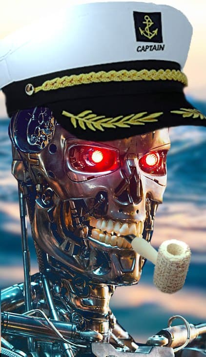

# TTK4851-GUL

## Seanet

## Plassering av kameraer og Bruk av maskinsyn til å detektere og telle mennesker og sykler på autofergen

### Setup

Last ned data fra Dropbox: https://www.dropbox.com/sh/35sw2e2k2mnfpey/AABfc_XbsDZG3jrlAkSZ40I8a?dl=0

Sett data mappen her, i denne mappen.

> cd TTK4851-GUL
> unzip ~/Downloads/data.zip

Installer opencv for python:

> pip3 install opencv-python

### Test

Test object_detection_yolov3.py

> python3 object_detection_yolov3.py

### Rapport

Prosess: https://www.overleaf.com/8761576379qgqdtqkyvccb

Prosjekt: https://www.overleaf.com/5628621316bwjsxvqghhgm

### Reklamefilm av autoferjen

Her er hvordan den neste autoferjen vil se ut: https://youtu.be/FuWedx0oLX4?t=107

## For en delt Dropbox-mappe:

Lag en symbolsk lenke til Dropbox-mappen her, i denne mappen.

> ln -s ~/Dropbox/data data

På Windows, start cmd.exe som admin:

> mklink /D data ..\Dropbox\data

Mer info: https://www.howtogeek.com/howto/16226/complete-guide-to-symbolic-links-symlinks-on-windows-or-linux/
